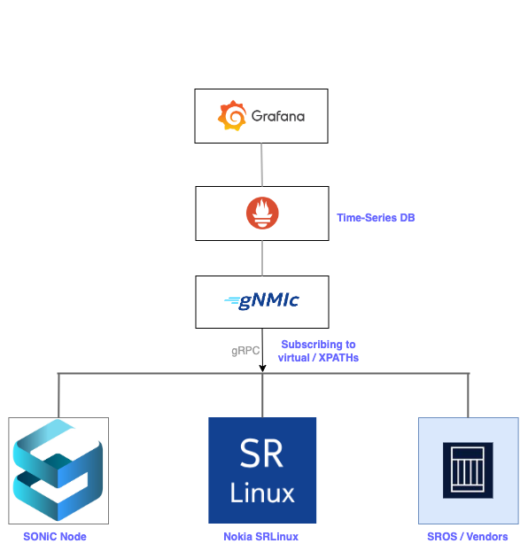

# SONiC Telemetry

[SONiC](https://github.com/sonic-net) has been implemented with gRPC for streaming telemetry. This lab will provide you steps to enable gnmi and its associated tools to stream metrics.



- [Installation](#installation)
	- [Adding Target Nodes](#adding-target-nodes)
	- [Enabling additional metrics](#enabling-additional-metrics)
- [Fixing the Telemetry Service at SONiC](#telemetry-service-at-sonic)
	- [gnmi configuration at SONiC](#gnmi-configuations-at-sonic)
- [gnmiC Example](#gnmic-command-line-utility)
- [New Versions of SONiC with gnmi container](##Newer-Versions-of-SONiC-has-a-different-method-to-enable-Telemetry)


## Tools Used

| Functions    | Tools Used | 
| -------- | ------- |
| Router/Switch  | [SONiC](https://github.com/sonic-net) on [Nokia IXR-7215](https://www.nokia.com/networks/ip-networks/service-router-linux-NOS/)    | 
| gnmi collector  | [gnmic](https://gnmic.openconfig.net)    | 
| TSDB  | [Prometheus](https://prometheus.io/)    | 
| Dashboard/UI  | [Grafana](https://grafana.com/)    | 
| Container Infra  | [containerlab](https://containerlab.dev/)    | 

## Installation

The tools stack are aforementioned and will use containerlab to deploy the tools. We are using DAIL-IN method, where the xpaths are set externally from gnmi collector.

Install [containerlab](https://containerlab.dev/install/) at your host machine/telemetry host (not at SONiC) before proceeding.

Note: At SONiC Node, Make sure the Telemetry container is up and running else fix the container with the instructions given below

**Deploy the Telemetry Stack**

1. Clone the repo

```
git clone https://github.com/mfzhsn/sonic-telemetry.git && cd sonic-telemetry
```

2. Deploy the stack
 
```
containerlab deploy -t telemetry-sonic.clab.yml
```
The above will pull all required images from the public repo (need internet connection), connect the application and configures them.

SONiC does not have complete yang data model yet implemented, Hence DB, TABLE and KEY are used to identify the data uniquely.

The virtual path concept is introduced for SONiC telemetry. It doesn't exist in SONiC redis database, telemetry module performs internal translation to map it to real data path and returns data accordingly.

## Adding Target Nodes

gnmiC is the client which dails-in to subscribe to various xpaths/virtual-paths to collect metrics. The gnmic config located at `tele-config/gnmic.yaml`.


*Note:* Adjust the target IP address with your environments/node`s IP, Username, Password and subscription information.
  
Example:

```
targets:
  #sonic
  10.1.0.116:57400:
    username: admin
    password: password
    encoding: json
    subscriptions:
      - sonic_port

  #srlinux
  10.1.0.201:57400:
    username: admin
    password: nok1a!
    encoding: json_ietf
    subscriptions:
      - srl_if_oper_state
      - srl_if_stats
      - srl_if_traffic_rate
      - srl_apps
      - srl_cpu
      - srl_mem
      
  # any other node
  xx.xx.xx.xx:gnmi_port
```

Once updated the new target, you can restart the gnmic container `docker restart clab-sonic-gnmic` or also redeploy the stack using `containerlab deploy -t telemetry-sonic.clab.yml --reconfigure`.

## Enabling additional metrics

gnmiC dails-in on specific yang paths also called as xpaths or virtual-paths(SONiC). gnmiC needs to be configured with the appropriate paths.

*Note:* Add or Update with your nodes`s xpath for gnmiC to collect metrics.

Example:

```
subscriptions:
  srl_if_oper_state:
    paths:
      - /interface[name=ethernet-1/*]/oper-state
    mode: stream
    stream-mode: sample
    sample-interval: 10s


  sonic_port:
    paths:
      - "COUNTERS/Ethernet0"
      - "COUNTERS/Ethernet1"
      - "COUNTERS/Ethernet32"
    target: COUNTERS_DB
    stream-mode: sample
    sample-interval: 10s
```

The above subscription `srl_if_oper_state` and `sonic_port` needs to be listed under the respective target nodes.


## Telemetry Service at SONiC

If the Telemetry container is up and running in your SONiC Node, you can skip this step and go directly to Installation.

**Fixing the Telemetry Container**

The SONiC device has the Telemetry container which might be in `exited` state, Lets fix this first.

```
admin@sonic:~$ docker ps --all
CONTAINER ID   IMAGE                             COMMAND                  CREATED        STATUS        PORTS     NAMES
ddedbed28641   docker-snmp:latest                "/usr/local/bin/supe…"   2 months ago   Up 42 hours             snmp
66da3f6d9754   docker-sonic-telemetry:latest     "/usr/local/bin/supe…"   2 months ago   Exited (0) 10 minutes ago             telemetry
3748af29ce98   2334c214e07f                      "/usr/bin/docker_ini…"   2 months ago   Up 42 hours             dhcp_relay
ef78a48ffdc2   docker-platform-monitor:latest    "/usr/bin/docker_ini…"   2 months ago   Up 42 hours             pmon
fb672d2ffd84   docker-lldp:latest                "/usr/bin/docker-lld…"   2 months ago   Up 42 hours             lldp
6c433abdc45b   docker-fpm-frr:latest             "/usr/bin/docker_ini…"   2 months ago   Up 42 hours             bgp
f870efdfce7a   docker-router-advertiser:latest   "/usr/bin/docker-ini…"   2 months ago   Up 42 hours             radv
a14167f26de8   docker-syncd-mrvl:latest          "/usr/local/bin/supe…"   2 months ago   Up 42 hours             syncd
abcbd9b80db5   docker-teamd:latest               "/usr/local/bin/supe…"   2 months ago   Up 42 hours             teamd
5539e083dd64   docker-orchagent:latest           "/usr/bin/docker-ini…"   2 months ago   Up 42 hours             swss
60e51e9afb20   docker-acms:latest                "/usr/local/bin/supe…"   2 months ago   Up 42 hours             acms
8ffd722b83d0   docker-database:latest            "/usr/local/bin/dock…"   2 months ago   Up 42 hours             database
```

You can check telemetry logs at `/var/log/telemetry.log`. SONiC will have baseline configurations for Telemetry/gnmi, and it will check for certs in the below path. Configurations can be checked either by running `show runningconfiguration all` or `cat /etc/sonic/config_db.json`

```
    "TELEMETRY": {
        "certs": {
            "ca_crt": "/etc/sonic/telemetry/dsmsroot.cer",
            "server_crt": "/etc/sonic/telemetry/streamingtelemetryserver.cer",
            "server_key": "/etc/sonic/telemetry/streamingtelemetryserver.key"
        },
``` 
**Generate certs**

a. Create a directory called `telemetry`

```
mkdir /etc/sonic/telemetry
```
Certificate

```
sudo openssl req -x509 -newkey rsa:4096 -keyout /etc/sonic/telemetry/dsmsroot.key -out /etc/sonic/telemetry/dsmsroot.cer -sha256 -days 365 -nodes -subj '/CN=sonic-lab'
```
CSR

```
sudo openssl req -new -newkey rsa:4096 -nodes -keyout /etc/sonic/telemetry/streamingtelemetryserver.key -out /etc/sonic/telemetry/streamingtelemetryserver.csr -subj "/CN=sonic-lab"
```
Key

```
sudo openssl x509 -req -in /etc/sonic/telemetry/streamingtelemetryserver.csr -CA /etc/sonic/telemetry/dsmsroot.cer -CAkey /etc/sonic/telemetry/dsmsroot.key -CAcreateserial -out /etc/sonic/telemetry/streamingtelemetryserver.cer -days 365 -sha512
```

Restart the telemetry container

```
sudo docker container restart telemetry
```

Verify that telemetry container should be up and running

```
admin@sonic:/etc/sonic$ docker ps
CONTAINER ID   IMAGE                             COMMAND                  CREATED        STATUS        PORTS     NAMES
ddedbed28641   docker-snmp:latest                "/usr/local/bin/supe…"   2 months ago   Up 42 hours             snmp
66da3f6d9754   docker-sonic-telemetry:latest     "/usr/local/bin/supe…"   2 months ago   Up 42 hours             telemetry
3748af29ce98   2334c214e07f                      "/usr/bin/docker_ini…"   2 months ago   Up 42 hours             dhcp_relay
ef78a48ffdc2   docker-platform-monitor:latest    "/usr/bin/docker_ini…"   2 months ago   Up 42 hours             pmon
fb672d2ffd84   docker-lldp:latest                "/usr/bin/docker-lld…"   2 months ago   Up 42 hours             lldp
6c433abdc45b   docker-fpm-frr:latest             "/usr/bin/docker_ini…"   2 months ago   Up 42 hours             bgp
f870efdfce7a   docker-router-advertiser:latest   "/usr/bin/docker-ini…"   2 months ago   Up 42 hours             radv
a14167f26de8   docker-syncd-mrvl:latest          "/usr/local/bin/supe…"   2 months ago   Up 42 hours             syncd
abcbd9b80db5   docker-teamd:latest               "/usr/local/bin/supe…"   2 months ago   Up 42 hours             teamd
5539e083dd64   docker-orchagent:latest           "/usr/bin/docker-ini…"   2 months ago   Up 42 hours             swss
60e51e9afb20   docker-acms:latest                "/usr/local/bin/supe…"   2 months ago   Up 42 hours             acms
8ffd722b83d0   docker-database:latest            "/usr/local/bin/dock…"   2 months ago   Up 42 hours             database
``` 

## gnmi Configuations at SONiC

Make sure the config for gnmi is already configured at SONiC. You can change the port number and authnetication options at `/etc/sonic/config_db.json` and reload the config using the command:

```
sudo config load config_db.json
```

For example in my case, my gnmi collector would be dailing  on port 57400 with insecure connection.

```
 "gnmi": {
            "client_auth": "false",
            "log_level": "2",
            "port": "57400"
        }
```

## gnmiC Command Line Utility

Lets get the data for Port-ETHERNET-35.

Ports data is stored in `COUNTER_DB` Similary the same can we used to configure in the file here `gnmic.yaml`.

* xpath : path
* xpath_target : target

Using [gnmiC](https://gnmic.openconfig.net/)

```
➜  telemetry gnmic -a 10.1.0.116:57400 -u admin -p password --skip-verify get --path COUNTERS/Ethernet35 --target COUNTERS_DB
[
  {
    "source": "10.1.0.116:57400",
    "timestamp": 1695604925855859308,
    "time": "2023-09-24T21:22:05.855859308-04:00",
    "target": "COUNTERS_DB",
    "updates": [
      {
        "Path": "COUNTERS/Ethernet35",
        "values": {
          "COUNTERS/Ethernet35": {
            "SAI_PORT_STAT_ETHER_IN_PKTS_1024_TO_1518_OCTETS": "0",
            "SAI_PORT_STAT_ETHER_IN_PKTS_128_TO_255_OCTETS": "5209",
            "SAI_PORT_STAT_ETHER_IN_PKTS_256_TO_511_OCTETS": "0",
            "SAI_PORT_STAT_ETHER_IN_PKTS_4096_TO_9216_OCTETS": "0",
            "SAI_PORT_STAT_ETHER_IN_PKTS_512_TO_1023_OCTETS": "0",
            "SAI_PORT_STAT_ETHER_IN_PKTS_64_OCTETS": "1",
            "SAI_PORT_STAT_ETHER_IN_PKTS_65_TO_127_OCTETS": "0",
            "SAI_PORT_STAT_ETHER_IN_PKTS_9217_TO_16383_OCTETS": "0",
            "SAI_PORT_STAT_ETHER_OUT_PKTS_4096_TO_9216_OCTETS": "0",
            "SAI_PORT_STAT_ETHER_OUT_PKTS_9217_TO_16383_OCTETS": "0",
            "SAI_PORT_STAT_ETHER_RX_OVERSIZE_PKTS": "0",
            "SAI_PORT_STAT_ETHER_STATS_FRAGMENTS": "0",
            "SAI_PORT_STAT_ETHER_STATS_JABBERS": "0",
            "SAI_PORT_STAT_ETHER_STATS_TX_NO_ERRORS": "5210",
            ~~ snip ~~
            "SAI_PORT_STAT_PFC_7_TX_PKTS": "0"
          }
        }
      }
    ]
  }
]
```

**Note**

The port mapping in the SONiC might mislead sometimes. The command `show interfaces alias` will provide mapping between the Front-Panel and the Internal Ports.

In my case, I have a cable from Front-Panel labelled as 37 towards Nokia SR, Consider that as etp37, while pulling some graphs, the query should be made on `Ethernet36` port.

```
admin@sonic:~$ show interfaces alias
Name        Alias
----------  -------
~ snip~~
Ethernet36  etp37
```
Example using gnmic for Physical Port 37

`gnmic -a 10.1.0.116:57400 sub --skip-verify --target COUNTERS_DB --path "COUNTERS/Ethernet36" --stream-mode sample --sample-interval 10s --format event`


## Newer Versions of SONiC has a different method to enable Telemetry

Step-1: Check if the gnmi container is running

```
docker ps | grep gnmi

```

Step-2: Start the gnmi service if not running

```
sudo systemctl start gnmi.service

```
Verify

```
admin@sonic:~$ sudo systemctl status gnmi.service
● gnmi.service - GNMI container
     Loaded: loaded (/lib/systemd/system/gnmi.service; static)
    Drop-In: /etc/systemd/system/gnmi.service.d
             └─auto_restart.conf
     Active: active (running) since Wed 2024-12-25 04:54:39 UTC; 49min ago
    Process: 52936 ExecStartPre=/usr/local/bin/gnmi.sh start (code=exited, status=0/SUCCESS)
   Main PID: 52963 (gnmi.sh)
      Tasks: 3 (limit: 4571)
     Memory: 29.1M
     CGroup: /system.slice/gnmi.service
             ├─52963 /bin/bash /usr/local/bin/gnmi.sh wait
             ├─52965 /bin/bash /usr/bin/gnmi.sh wait
             └─52966 python3 /usr/local/bin/container wait gnmi

Dec 25 04:54:39 sonic container[52952]: container_start: gnmi: set_owner:local fallback:True remote_state:none server_connected:false
Dec 25 04:54:39 sonic container[52952]: docker cmd: start for gnmi
Dec 25 04:54:39 sonic container[52952]: container_start: END
Dec 25 04:54:39 sonic systemd[1]: Started gnmi.service - GNMI container.
Dec 25 04:54:39 sonic container[52966]: container_wait: BEGIN
Dec 25 04:54:39 sonic container[52966]: read_data: config:True feature:gnmi fields:[('set_owner', 'local'), ('no_fallback_to_local', False), ('state', 'disabled')] val:['local', False, 'enabled']
Dec 25 04:54:39 sonic container[52966]: read_data: config:False feature:gnmi fields:[('current_owner', 'none'), ('remote_state', 'none'), ('container_id', '')] val:['none', 'none', '']
Dec 25 04:54:39 sonic container[52966]: docker get image version for gnmi
Dec 25 04:54:39 sonic container[52966]: container_wait: gnmi: set_owner:local ct_owner:none state:none id:gnmi pend=0
Dec 25 04:54:39 sonic container[52966]: container_wait: END -- transitioning to docker wait
```

Step-3: Enable the gnmi feature

```
sudo config feature state gnmi enabled
```

Step-4: Restart the service

```
sudo systemctl restart gnmi.service
```

Verify, in the newer version the gnmi is running on port `8080`

```
sudo netstat -tuln | grep 8080
```

Output:

```
admin@sonic:~$ sudo netstat -peanut | grep 8080
tcp6       0      0 :::8080                 :::*                    LISTEN      0          599818     57957/telemetry
```
